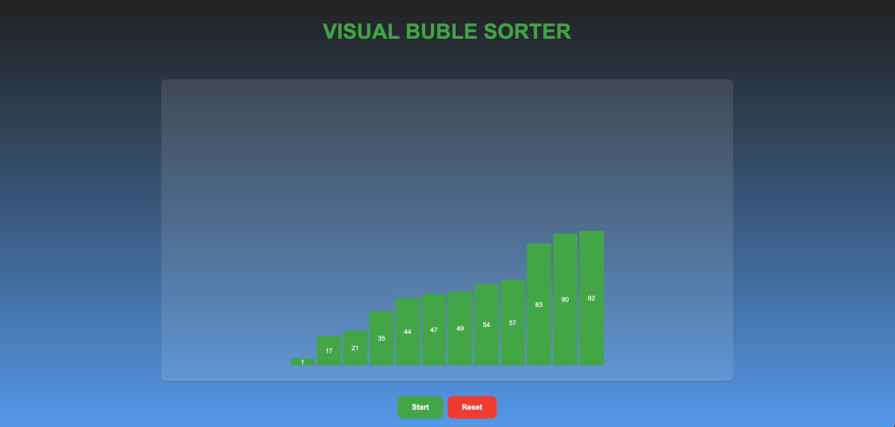

# Visual Sorter

Visual Sorter is a browser-based application designed to visualize sorting algorithms step by step. It provides an interactive and engaging way to understand how sorting works, with responsive design for all screen sizes.

---
**Screenshot:**

## Features

- **Interactive Table**: Displays the sorting process step by step in a clear and visually appealing table.
- **Control Buttons**: Includes "Start" and "Reset" buttons for easy interaction.
- **Responsive Design**: Optimized for desktops, tablets, and mobile devices.
- **Modern UI**: Clean and professional styling.

---

## Demo

- [YouTube Demo](https://www.youtube.com/watch?v=CIZvjLl5W8E)

  
